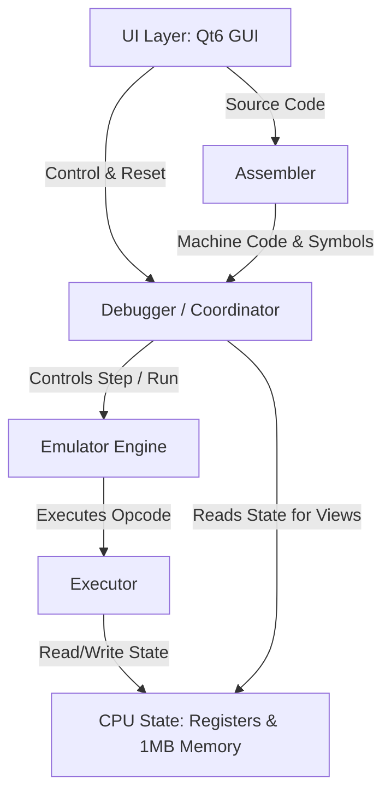

# Architecture and Code Documentation for **memu8086**

This document provides a comprehensive overview of the design, structure, and implementation of **memu8086**, a modern, cross-platform Intel 8086 emulator and assembler built with C++ and Qt6.

---

## 1. High-Level Architecture ("Why")

The design of **memu8086** follows a clean separation of concerns:


### Key Architectural Decisions
1. **Separation of Emulator Core from UI**: The emulation core (`src/core/`) is independent of any GUI logic. It operates on standard C++ structures and arrays, allowing the core to be tested, run in headless mode, or integrated into different interfaces.
2. **Heap Allocation for Core States**: In [main.cpp](file:///home/stup/projects/memu8086/src/main.cpp#L43-L48), the [CPU](file:///home/stup/projects/memu8086/src/core/cpu.h#L84), [Assembler](file:///home/stup/projects/memu8086/src/assembler/assembler.h#L48), and [Debugger](file:///home/stup/projects/memu8086/src/core/debugger.h#L58) are allocated on the heap (`std::make_unique`). This prevents stack overflows, as the 8086 memory space contains a full $1\text{ MB}$ array (`std::array<uint8_t, 1024*1024>`).
3. **Synchronous Assembly-to-Execution Mapping**: The [Assembler](file:///home/stup/projects/memu8086/src/assembler/assembler.h#L48) outputs not just machine code, but metadata maps linking line numbers to offset instructions ([AssemblyResult](file:///home/stup/projects/memu8086/src/assembler/assembler.h#L31)). This allows the [Debugger](file:///home/stup/projects/memu8086/src/core/debugger.h#L58) to highlight the currently executing line in the UI editor in real-time.

---

## 2. Core Modules Breakdown & Implementation ("How")

### A. The Assembler (`src/assembler/`)

The [Assembler](file:///home/stup/projects/memu8086/src/assembler/assembler.cpp) is implemented as a **two-pass custom assembler** that directly generates machine code bytes:
*   **Tokenization & Line Parsing**: Input source code is split line-by-line. Comments (starting with `;`) are stripped, labels (terminated by `:`) are extracted, and mnemonics and operands are tokenized.
*   **Expression Evaluation**: An internal helper `evaluate_expression` recursively evaluates labels, constants, math operators (`+`, `-`), and special directives (`LENGTH`, `SIZE`, `TYPE`, `@DATA`).
*   **Pass 1 (Symbol Resolution & Offset Calculation)**:
    *   Walks the tokenized instruction lines.
    *   Tracks the Location Counter (LC).
    *   Registers data labels (`DB`/`DW`/`DD`), code labels, and segments in the symbol table.
    *   Estimates instruction sizes (in bytes) to advance the Location Counter.
*   **Pass 2 (Machine Code Generation)**:
    *   Re-runs through instructions, resolving labels/symbol names using the symbol table built during Pass 1.
    *   Compiles registers, memory expressions, and immediate values into binary bytes.
    *   Packs operands into standard **ModR/M** formats using the helper `emit_modrm()`.
    *   Builds bidirectional line-to-offset and offset-to-line maps for visual debug tracking.

### B. The Emulator Core (`src/core/`)

The core emulates the physical Intel 8086 microprocessor state and instruction lifecycle.

*   **[CPU State](file:///home/stup/projects/memu8086/src/core/cpu.h)**:
    *   **Registers**: Designed in C++ using structured alignment. The 16-bit register pairings (e.g. AX, BX, CX, DX) are represented as `uint16_t` values. Sub-byte access (e.g. `AL()`, `AH()`) is implemented using `reinterpret_cast<uint8_t*>` pointers onto the 16-bit register word, assuming a little-endian host architecture.
    *   **Memory**: Implemented as a flat array `std::array<uint8_t, 1048576>` (1MB address space). Functions `read8`, `read16`, `write8`, and `write16` perform standard memory reads and writes, resolving logical `segment:offset` pairs to physical 20-bit addresses via:
        $$\text{Physical Address} = (\text{Segment} \times 16) + \text{Offset}$$
*   **[Executor (Instruction Decoder)](file:///home/stup/projects/memu8086/src/core/cpu_exec.cpp)**:
    *   **Fetch**: Reads 8-bit or 16-bit opcodes from the physical memory address pointed to by CS:IP, then increments the Instruction Pointer (`IP`).
    *   **Decode (ModR/M resolution)**: The `decode_modrm()` method parses the standard ModR/M byte. It extracts:
        *   `mod` (2 bits) & `r/m` (3 bits) to determine if the operand is a register or memory offset (e.g. `[bx+si]`, `[bp+di]`).
        *   `reg` (3 bits) to identify the source/destination register.
        *   It then resolves segment-override prefixes (CS, DS, ES, SS) if present.
    *   **ALU Operations**: A central `alu_op()` method simulates standard arithmetic (ADD, ADC, SUB, SBB, CMP) and bitwise operations (AND, OR, XOR, TEST). It dynamically updates the carry, sign, zero, parity, and overflow flags based on the inputs and results.
*   **[Interrupts Handling](file:///home/stup/projects/memu8086/src/core/interrupts.cpp)**:
    *   Intercepts software interrupt calls (`INT <num>`).
    *   Provides basic implementations of standard DOS services (`INT 21h`), including console print string (`AH = 09h`), read char (`AH = 01h`/`08h`), and terminate program (`AH = 4Ch`), translating them into interactive host operations (reading from/writing to `ConsoleState`).
*   **[Debugger Engine](file:///home/stup/projects/memu8086/src/core/debugger.cpp)**:
    *   Controls execution execution flow: `step()`, `step_over()`, `run()`, and `stop()`.
    *   Provides a standard scheduler wrapper `run_frame(dt)` that runs a fixed amount of CPU execution cycles depending on the target emulator frequency (Instructions Per Second).
    *   Keeps track of `CPUSnapshot` records (prior CPU registers and flags state) to visually highlight changed values in the UI panels after each instruction executes.

### C. The Graphical User Interface (`src/ui/`)

The GUI relies on Qt6's signal-slot mechanism and custom layouts to render and control the emulated hardware:

*   **[MainWindow](file:///home/stup/projects/memu8086/src/ui/mainwindow.cpp)**: Orchestrates the panels. It handles operations like compiling assembly, feeding binary instructions into the emulator, running/pausing, and configuring themes.
*   **[EditorPanel](file:///home/stup/projects/memu8086/src/ui/editor_panel.cpp)**: Extends `QPlainTextEdit` with a custom [Syntax Highlighter](file:///home/stup/projects/memu8086/src/ui/highlighter.cpp) subclassing `QSyntaxHighlighter`. It formats assembly mnemonics, numbers, registers, and comments. It also maintains a gutter bar displaying line numbers and breakpoint points.
*   **[MemoryPanel](file:///home/stup/projects/memu8086/src/ui/memory_panel.cpp)**: Implements an interactive grid subclassing `QAbstractTableModel`. Rather than rendering $1\text{ MB}$ of rows, it leverages virtual scrolling to only read and render the memory offsets currently visible on screen.
*   **[ConsolePanelWidget](file:///home/stup/projects/memu8086/src/ui/console_panel_widget.cpp)**: Custom widget representing the terminal console screen. It reads the raw screen array from [ConsoleState](file:///home/stup/projects/memu8086/src/core/debugger.h#L38) and uses standard Qt painting techniques to draw the text matrix, cursor position, and handle keystrokes.
*   **[RegistersPanel](file:///home/stup/projects/memu8086/src/ui/registers_panel.cpp)** & **[StackPanel](file:///home/stup/projects/memu8086/src/ui/stack_panel.cpp)**: Render registers and stack elements, using snapshots from the debugger to highlight fields that changed color dynamically in red.

---

## 3. Code Directory Layout

The codebase is structured as follows:

```text
memu8086/
├── CMakeLists.txt              # Primary CMake configuration
├── src/
│   ├── main.cpp                # App entrypoint & component orchestration
│   ├── assembler/              # Assembly parser & compiler
│   │   ├── assembler.h
│   │   └── assembler.cpp
│   ├── core/                   # 8086 CPU, memory, executor, and debugger
│   │   ├── cpu.h / cpu.cpp
│   │   ├── cpu_exec.h / cpu_exec.cpp
│   │   ├── debugger.h / debugger.cpp
│   │   ├── emulator.h / emulator.cpp
│   │   ├── disassembler.h / disassembler.cpp
│   │   └── interrupts.h / interrupts.cpp
│   └── ui/                     # Qt6 widgets and main windows
│       ├── mainwindow.h / mainwindow.cpp
│       ├── editor_panel.h / editor_panel.cpp
│       ├── registers_panel.h / registers_panel.cpp
│       ├── memory_panel.h / memory_panel.cpp
│       ├── stack_panel.h / stack_panel.cpp
│       ├── variables_panel.h / variables_panel.cpp
│       ├── console_panel_widget.h / console_panel_widget.cpp
│       └── theme.h / theme.cpp
```
